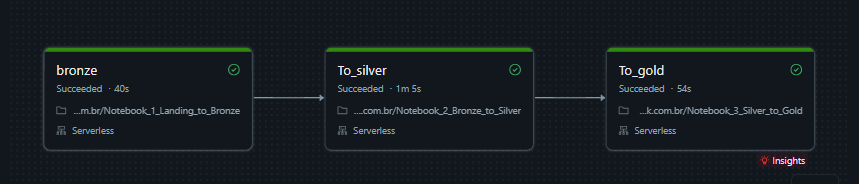

# CineData

Pipeline de dados em arquitetura Medallion (Bronze, Silver, Gold) no Databricks, com PySpark e Delta, para o projeto CineData Analytics (Rocket Lab 2026).

## Dataset

Base de filmes combinando dados do TMDB e do IMDB, mais a cotacao do dolar (PTAX) do Banco Central do Brasil para analisar orcamento e receita tambem em reais.

| Arquivo | Conteudo | Colunas principais |
|---|---|---|
| `movies_info_TMDB_IMDB.csv` | Informacoes gerais do filme | `id`, `tconst`, `title`, `original_title`, `original_language`, `release_date`, `runtime`, `status`, `overview`, `tagline` |
| `movies_financials_IMDB_TMDB.csv` | Financeiro | `id`, `budget`, `revenue` |
| `movies_metrics_IMDB_TMDB.csv` | Popularidade e notas | `id`, `popularity`, `vote_average`, `vote_count`, `averageRating`, `numVotes` |
| `credits_and_tags_IMDB_TMDB.csv` | Elenco, equipe e classificacoes | `id`, `genres`, `production_companies`, `production_countries`, `spoken_languages`, `keywords`, `directors`, `writers`, `cast` |
| `movies_reviews.csv` | Avaliacoes de usuarios | `id`, `nome`, `nota`, `comentario` |
| API PTAX (Banco Central) | Cotacao do dolar por dia util | `dataHoraCotacao`, `cotacaoCompra` |

Todos os arquivos se relacionam pelo `id` do filme. Os dados brutos trazem ruido proposital: valores `Unknown`, datas em varios formatos, separadores de milhar e decimal diferentes e listas separadas por `,`, `;` ou `|`, tratados na camada Silver.

## Camadas

| Notebook | Camada | O que faz |
|---|---|---|
| `notebooks/Notebook_1_Landing_to_Bronze.ipynb` | Bronze | Ingere os CSVs do Volume e a cotacao PTAX em Delta, modo append, com `ingestion_datetime` |
| `notebooks/Notebook_2_Bronze_to_Silver.ipynb` | Silver | Deduplica, tipa e padroniza os dados |
| `notebooks/Notebook_3_Silver_to_Gold.ipynb` | Gold | Dimensoes, pontes, fato de desempenho, documento de contexto para RAG e consultas de negocio |

## Execucao do job

Job com 3 tasks encadeadas (`bronze` -> `To_silver` -> `To_gold`) em compute serverless:

